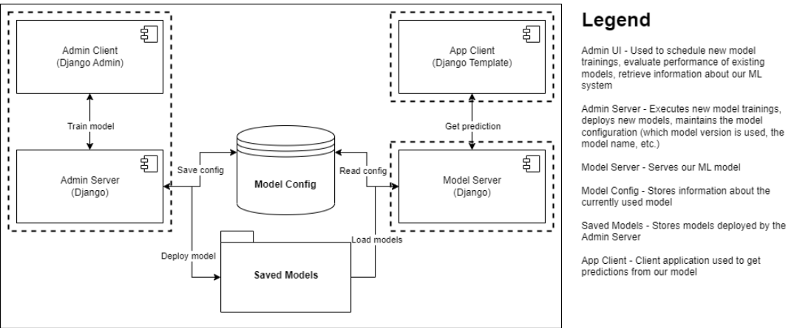

# Flixpredix - Movie Score Generator

## Overview
Is it possible to know how well a movie will perform at the box office before its release? That is the question our team asks when creating this project. Our concept idea is to predict movie ratings on coming movies. The predicted ratings will be based on prior movies, their ratings and everything that stands behind the creation of that movie such as actors, directors, script as well as genre, budget, producers and writers. We figured that everybody that is interested in movies and the movie business wants to know if a movie will be worth the money, if the movie is even worth the production and effort to be made. Today's market with social media and big fan bases around different books and comics, you can see how a movie can get created solely on a concept that a wide fan base wants it to happen. To help stakeholders all around the movie industry get an idea of what, if, and how a movie would be successful or not. For a user, the idea is to be able to start our application, filter on various features and details that the movie would consist of. Factors such as which director, which actors, language spoken, what writers, how big of a budget etc. and then get a general predicted idea of rating and earnings based on what the user has entered to be created. 

## Installation & Use
The following things need to be installed:

* [Node][node_link]
* [Docker][docker_link]

[docker_link]: https://www.docker.com/
[node_link]: https://nodejs.org/en/download/

Do the following to access the application locally.

##### Build Node package
Within the \FlixPredix\flixpredix-app\ folder
```
npm install

```
##### Start Node server
```
npm run serve
```

The application should then be seen at http://localhost:8080/

##### Build server image
Within the \Model\ folder:
```
docker build -t flixpredix/server .
```

##### Start Docker server

```
docker run -p 8080:80 flixpredix/server 
```

##### Running Tests

```
pip install numpy pandas pytest csv_to_sqlite
cd Model/scripts/
pytest test.py -v
```

## How It Works
[ Technical description shall go here. ]

### Component Diagram




## Credits
- Adam Frison, gusfrisoad@student.gu.se, adamfris
- Carl Andreasson, gusandcafg@student.gu.se, carlandr
- Edvin Danielsson, gusdanieed@student.gu.se, edvinda
- Felix Mertala, gusmertfe@student.gu.se, felixmer
- Marcus Andersson, gusqanuqma@student.gu.se, maruk
- Mislav Milicevic, gusmilicmi@student.gu.se, mislav

Project was made in conjunction with the course "DIT825 Software Engineering for Data-Intensive AI Applications" (University of Gothenburg).
